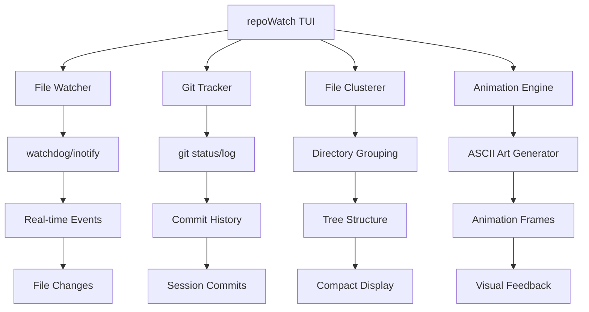
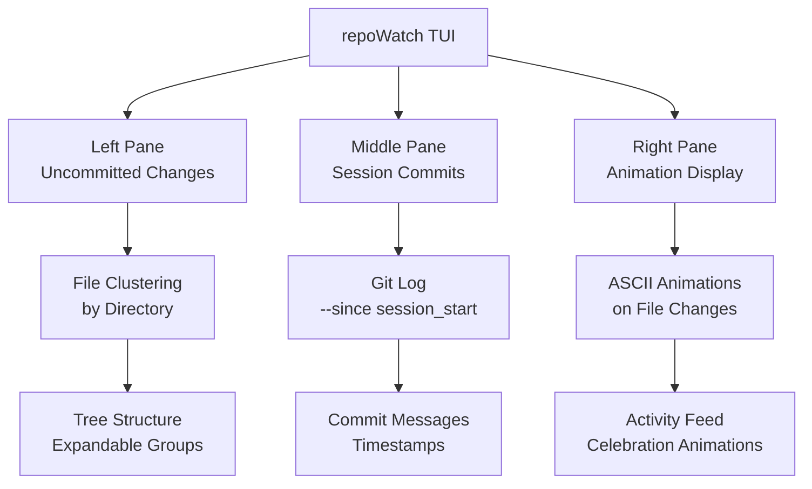

# repoWatch

> *"What's happening in my codebase right now? What's been changed since I started working?"* — You, probably


## The Problem

It's midnight. You have **3 feature branches open**. You've been working on **that authentication refactor** for two days, but wait — did you commit those changes yet? And what about that API endpoint you were debugging earlier? Did you actually fix it, or are you still scrolling through logs?

You're a **deep coder**. You don't just write code. You *inhabit* it. You live in the terminal, you breathe in git status, you dream in file changes. But then comes **The Moment™**: *"Wait, what exactly changed in this repo today?"*

You freeze. You're knee-deep in code, but you can't remember what you've actually *done*. It's all a beautiful blur of:

- *"Just one more file to fix..."*
- *"Wait, let me check git status first"*
- *"Oh crap, I need to commit these changes"*
- *"What was I working on again?"*

**Your terminal is your home. Your git history is your memory. This tool is your awareness.**

## The Solution

This is a **real-time git repository watcher** that monitors your active work in a beautiful terminal interface. It shows you exactly what's changed, what's committed, and celebrates your progress with ASCII art animations.

Finally, you can answer: *"What have I actually accomplished in this coding session?"* by looking at your terminal, not scrolling through git logs.

### Features

- **Three-Pane TUI Interface** — Beautiful terminal-based layout with dedicated panes for different views
- **Real-Time File Monitoring** — Watchdog-powered file system monitoring with instant change detection
- **Smart File Clustering** — Groups files by parent directories for visual compactness (`/inject/... (5 files)`)
- **Git History Tracking** — Shows committed changes since session start, organized by directory clusters
- **ASCII Art Animations** — Celebrates file changes with animated ASCII art in the main display pane
- **Session-Based Tracking** — Tracks your work session from the moment you start watching
- **Git Status Integration** — Real-time uncommitted changes with staged/unstaged status
- **Directory-Based Organization** — Files grouped by common parent paths for efficient navigation
- **Configurable Refresh Rates** — Adjustable polling intervals for performance tuning
- **Theme Support** — Dark terminal theme with accent colors (plundered from the original web UI)
- **Keyboard Navigation** — Full keyboard shortcuts for pane switching and interaction
- **Repository Targeting** — Point at any git repository for monitoring

## Perfect For

- 🔍 **Deep Divers** — Track exactly what files you've touched in your current coding session
- 📊 **Session Accountants** — Know what you've committed vs what you've only modified
- 🎨 **Terminal Aesthetics** — Enjoy beautiful ASCII animations celebrating your work
- 📁 **Large Project Managers** — See file changes clustered by directory for efficient navigation
- ⚡ **Real-Time Watchers** — Monitor file changes as they happen with instant feedback
- 🎯 **Focus Maintainers** — Stay aware of your current work without losing context

## Interface

Your real-time git repository command center:

```
┌─────────────────────────────────────────────────────────────────────────────────┐
│ repoWatch - /home/owner/git/serverGenesis              [F1:Help] [F2:Settings] │
├─────────────────────────────────────────────────────────────────────────────────┤
│  ┌─ Uncommitted Changes ─┐  ┌─ Committed (Session) ─┐  ┌─ Animation Display ──┐  │
│  │                        │  │                        │  │                      │  │
│  │ /inject/... (5 files)  │  │ /docs/... (3 files)    │  │    🎉 FILE CHANGED!   │  │
│  │   ├── flask/           │  │   ├── memories/        │  │                      │  │
│  │   │   ├── app.py       │  │   │   ├── notary.md   │  │      (∩｀-´)⊃━☆ﾟ.*･｡  │  │
│  │   │   └── routes.py    │  │   │   └── solved/     │  │                      │  │
│  │   └── premium/         │  │   └── cold-storage/   │  │   ✨ /inject/flask/   │  │
│  │       ├── backupTab/   │  │                        │  │      app.py modified  │  │
│  │       └── fileBrowser/ │  │ /initialization/...   │  │                      │  │
│  │                        │  │   ├── networkservices/│  │   [ASCII Animation]   │  │
│  │ /docs/memories/        │  │   └── filesystem/     │  │                      │  │
│  │   ├── notary.md        │  │                        │  │      \(*^^)/*        │  │
│  │   └── solved/          │  │ Status: 12 files      │  │                      │  │
│  │                        │  │ changed, 3 committed  │  │  Last: 2s ago        │  │
│  └────────────────────────┘  └────────────────────────┘  └──────────────────────┘  │
│ Session started: 2025-12-19 14:30:00    Git status: Clean (12 uncommitted)         │
└─────────────────────────────────────────────────────────────────────────────────┘
```

### Three-Pane Layout

**Left Pane: Uncommitted Changes**
- Shows files changed but not committed
- Clustered by parent directory for compactness
- Indicates staged/unstaged status
- Real-time updates as you edit files

**Middle Pane: Committed Changes**
- Files committed since session start
- Also clustered by directory structure
- Shows commit messages and timestamps
- Tracks your session's progress

**Right Pane: Animation Display**
- Largest pane for visual feedback
- ASCII art animations on file changes
- Shows recent activity and celebrations
- Configurable animation styles

## Installation

### Prerequisites

- Python 3.9+
- Git repository to monitor
- Terminal with support for modern TUI (256 colors recommended)

### Quick Start

```bash
# Navigate to the repoWatch directory
cd repoWatch

# Point at your git repository and start watching
# (Virtual environment and dependencies are handled automatically)
./run.sh --repo /path/to/your/git/repo

# Or watch current directory if it's a git repo
./run.sh --repo .
```

**First run will automatically:**
- Create a virtual environment (`venv/`)
- Install required dependencies
- Start monitoring your repository

### Manual Virtual Environment Setup (Optional)

If you prefer to set up manually:

```bash
# Navigate to the repoWatch directory
cd repoWatch

# Create virtual environment
python3 -m venv venv
source venv/bin/activate  # Linux/macOS

# Install dependencies using venv pip
venv/bin/pip install -r requirements.txt

# Run the tool
./run.sh --repo /path/to/your/git/repo
```

### Virtual Environment Setup

```bash
# Create virtual environment
python3 -m venv venv

# Activate virtual environment
source venv/bin/activate  # Linux/macOS
# venv\Scripts\activate   # Windows

# Install dependencies using venv pip (important for Arch Linux)
venv/bin/pip install -r requirements.txt

# Run the tool
./run.sh --repo /path/to/repo
```

**Note for Arch Linux users:** Always use `venv/bin/pip` instead of system `pip` to avoid PEP 668 errors.

## Usage

### Basic Commands

```bash
# Watch current directory (must be git repo)
./run.sh

# Watch specific repository
./run.sh --repo ~/projects/my-app

# Set custom refresh interval (seconds)
./run.sh --repo ~/projects/my-app --refresh 2

# Show help
./run.sh --help
```

### Configuration Options

| Flag | Description | Default |
|------|-------------|---------|
| `--repo PATH` | Git repository to monitor | Current directory |
| `--refresh SEC` | File system polling interval | 1 second |
| `--config FILE` | Custom configuration file | `~/.config/repoWatch/config.json` |
| `--theme THEME` | Color theme (dark/light) | dark |
| `--help` | Show help message | - |

## Architecture

### System Overview

### System Components



### Data Flow

1. **File Monitoring** → Watchdog detects file system changes
2. **Git Integration** → Query git status and recent commits
3. **Clustering** → Group files by parent directories
4. **Display** → Update TUI panes with real-time data
5. **Animation** → Trigger ASCII animations on file changes

### File Clustering Algorithm

repoWatch organizes files by their parent directories to keep the display compact:
**Clustering Rules:**
- Group by common parent directory paths
- Show counts in parentheses for collapsed groups
- Expandable tree structure for navigation
- Maximum depth of 3 levels to prevent visual clutter

## Usage Guide

### Navigation

- **Tab** / **Shift+Tab** — Switch between panes
- **↑/↓** — Navigate within current pane
- **Enter** — Expand/collapse directory groups
- **F1** — Show help
- **F2** — Open settings
- **Ctrl+C** — Exit

### Panes

**Left Pane (Uncommitted Changes):**
- Shows files modified but not committed
- Green dot = staged, yellow = unstaged
- Click to see diff or stage/unstage

**Middle Pane (Session Commits):**
- Files committed since you started watching
- Shows commit messages and timestamps
- Organized by directory clusters

**Right Pane (Animation Display):**
- Celebrates file changes with ASCII animations
- Shows recent activity feed
- Configurable animation styles

## Technical Stack

- **TUI Framework:** Textual (async Python TUI library)
- **File Watching:** watchdog (cross-platform file monitoring)
- **Git Integration:** GitPython (Python git operations)
- **Animation:** Custom ASCII art engine
- **Configuration:** JSON-based settings with hot reload

## Project Structure

```
repoWatch/
├── run.sh              # Controller script with CLI flags
├── requirements.txt    # Python dependencies
├── venv/               # Virtual environment (gitignored)
├── repo_watch.py       # Main Textual TUI application
├── file_watcher.py     # watchdog-based file monitoring
├── git_tracker.py      # Git status and history tracking
├── file_cluster.py     # Directory-based file grouping
├── animations.py       # ASCII art animation system
└── styles/
    └── theme.py        # Color schemes and styling
```

## Styling Reference

The visual design is "plundered" from the original web-based Claude history analyzer:

```css
:root {
  --bg-primary: #0d1117;
  --bg-secondary: #161b22;
  --bg-tertiary: #21262d;
  --text-primary: #e6edf3;
  --text-secondary: #8b949e;
  --border-color: #30363d;
  --accent-blue: #58a6ff;
  --accent-green: #3fb950;
  --accent-purple: #a371f7;
}
```

**Design Principles:**
- Dark terminal theme with high contrast
- Consistent spacing and typography
- Accent colors for interactive elements
- Clean, minimal aesthetic focused on content

### Three-Pane Layout Diagram



## Animation Examples

```
🎉 FILE CHANGED!
   (∩｀-´)⊃━☆ﾟ.*･｡

   ✨ /inject/flask/app.py modified
   Last change: 2 seconds ago

      \(*^^)/*
```

```
🚀 COMMIT DETECTED!

   [✓] /docs/README.md committed
   "Update installation instructions"

      (ﾉ◕ヮ◕)ﾉ*:･ﾟ✧
```

## Development Context

This is a complete **overhaul and jacking** of the original Claude Code history analyzer. The original tool was designed for tracking AI agent conversations across projects. This version transforms it into a **real-time git repository watcher** with terminal UI and ASCII animations.

**What was plundered:**
- Visual design system and color palette
- Real-time monitoring concepts
- Session-based tracking patterns
- Clean, functional UI principles

**What was rebuilt:**
- File system monitoring instead of Claude sessions
- Git integration instead of conversation history
- TUI interface instead of web interface
- ASCII animations instead of web notifications

## Troubleshooting

**Q: Tool shows no files?**
A: Make sure you're in a git repository or specify `--repo /path/to/repo`

**Q: Animations not showing?**
A: Check terminal supports Unicode. Try `--theme ascii` for simpler animations.

**Q: High CPU usage?**
A: Increase `--refresh` interval or exclude large directories in config.

**Q: Git commands failing?**
A: Ensure git is installed and repository is accessible.

## Future Enhancements

- **Sound notifications** for file changes
- **GitHub integration** for remote repository monitoring
- **Custom animation themes** and styles
- **Session persistence** across restarts
- **Multi-repository monitoring**
- **Commit message suggestions**
- **File change diff previews**

## Contributing

This tool is built for **terminal lovers** and **git enthusiasts**. Contributions welcome:

- Animation ideas and ASCII art
- Performance optimizations
- Cross-platform compatibility
- New clustering algorithms
- Additional git integrations

## License

MIT — Built for the terminal, by terminal users.

---

*Transformed from a Claude history tracker into a git repository watcher, because sometimes you need to see your code changes dance.*

🔍 **Your repository's pulse, in beautiful terminal form.**

⚡ **Happy watching!**

